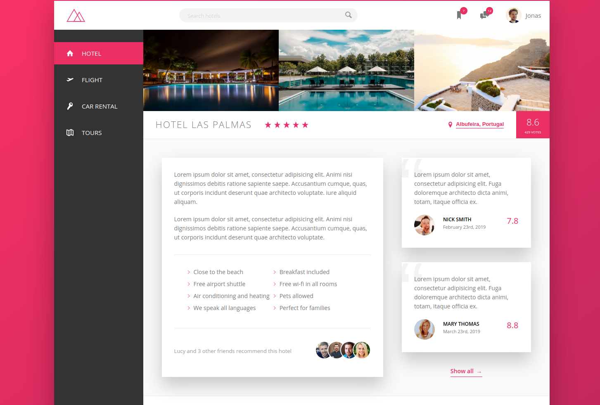

</img>

<h1 align="center">Trillo - Booking App</h1>

# Sobre o projeto

Esse projeto faz parte de um curso que contém mais 2 projetos focados em CSS e Sass. Foi um dos primeiros cursos que eu fiz nos meus primeiros meses programando. Excelente professor: <a href="https://github.com/jonasschmedtmann">Jonas Schmedtmann</a> e excelente material de consulta.

# Instalando dependências e rodando o projeto

Digite em sua cmd ```` npm install / yarn install ```` para instalar as dependências. 
Vale ressaltar que apenas baixando o código você já será capaz de ver o resultado em tela. Mas caso queira fazer modificações, terá que baixar as dependências.

Para compilar o sass, rode ```` yarn watch:sass / npm run watch:sass ````. 
Existe uma extensão de live compiler de Sass no vscode, é mais prático usar essa extensão.

Para compilar o sass, prefixar e comprimir o css, rode ```` yarn build:css / npm run build:css ````.